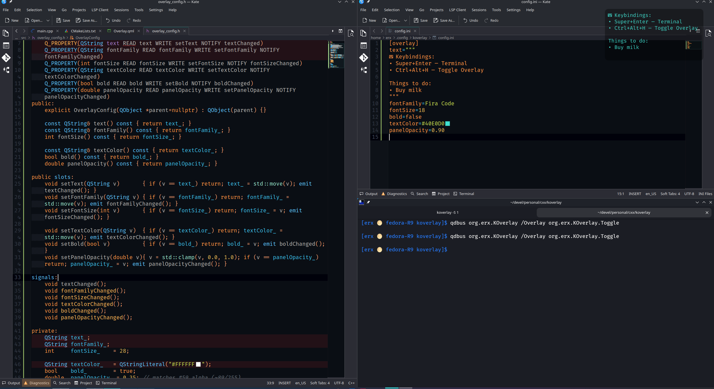
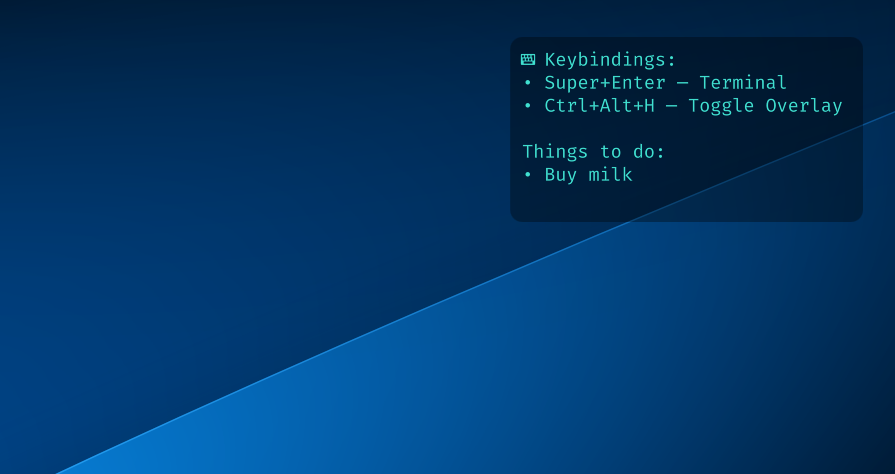

# KOverlay

Click‑through, always‑on‑top **overlay panel** for Wayland desktops (tested on **Fedora KDE/Plasma Wayland**) built with **Qt 6 + QML + LayerShellQt**.  
Perfect for **sticky notes**, **cheat sheets**, **keybindings**, or any text you want visible above apps — without stealing focus. Supports **live‑reloading** from a config file.

<p align="center">
  <i>Toggle from a global shortcut, stays above everything, passes all mouse/keyboard through.</i>
</p>

---

## Screenshots

<p align="center">
  <a href="assets/code.png">
    
  </a>
  <a href="assets/desktop.png">
    
  </a>
</p>

---

## Features

- 🧼 **Click‑through**: never steals input; all clicks/keys go to the app underneath.
- 📌 **Always on top**: pinned using `layer-shell` on the compositor.
- 🖥️ **Multi‑monitor aware**: choose target monitor with `--screen-index`.
- ⚡ **Hot‑reloading config**: edit `~/.config/koverlay/config.ini` and changes apply immediately.
- ✍️ **Customizable text**: font family, size, color, bold.
- 🌫️ **Panel background opacity**: fade the backdrop while keeping text fully opaque.
- 🚌 **DBus control**: `Toggle`, `Show`, `Hide` for easy desktop shortcuts.
- 📦 **RPM packaging** via CPack.

> **Wayland only.** Tested on Fedora KDE (KWin/Wayland). Other Wayland compositors may work, but KOverlay currently targets KDE Plasmashell/KWin + LayerShellQt.

---

## Dependencies

On **Fedora** (42+), install the runtime/build deps:

```bash
sudo dnf install -y   qt6-qtbase-devel qt6-qtdeclarative-devel qt6-qtwayland-devel   layer-shell-qt-devel wayland-devel
```

Runtime packages users typically need (automatically pulled by RPM):
- `layer-shell-qt`
- `qt6-qtbase`
- `qt6-qtdeclarative`
- `qt6-qtwayland`

---

## Build & Run

This repo includes three helper scripts:

```text
./build_bin.sh   # builds a Release binary into ./build and leaves it there
./build_rpm.sh   # builds an RPM using CPack into ./build
./run.sh         # runs the built binary with Wayland platform
```

### Manual build (CMake)
```bash
mkdir -p build && cd build
cmake -DCMAKE_BUILD_TYPE=Release ..
cmake --build . -j
```

### Run
```bash
QT_QPA_PLATFORM=wayland ./koverlay --show --screen-index 0
# --show          start visible
# --screen-index  choose monitor (0..N-1; 0 is typically primary)
```

---

## Configuration (hot‑reloading)

Default config file path:
- `~/.config/koverlay/config.ini`

Override with environment variable:
- `KOVERLAY_CONFIG=/path/to/config.ini`

KOverlay watches the file and reloads on save.

### Supported keys (section `[overlay]`)

| Key         | Type     | Example                                  | Notes |
|-------------|----------|-------------------------------------------|-------|
| `text`      | string / multiline | see examples below              | Overlay text. Multiline supported (triple quotes or YAML‑style pipe). `\n` also works. |
| `textFile`  | path     | `~/.config/koverlay/overlay.txt`          | If set, file contents override `text`. |
| `fontFamily`| string   | `Fira Code`                               | Leave empty to use system default. |
| `fontSize`  | int      | `22`                                      | Pixels. |
| `textColor` | string   | `#FFCC00` or `tomato`                     | Any QML color. |
| `bold`      | bool     | `true` / `false`                          | Toggle bold text. |
| `panelOpacity` | double | `0.30`                                   | 0.0 (transparent) … 1.0 (opaque). Only the background fades; text remains fully opaque. |

### Examples

**A) Triple‑quoted multiline inside INI (recommended)**
```ini
[overlay]
text="""
⌨ Keybindings:
• Super+Enter — Terminal
• Ctrl+Alt+H — Toggle Overlay
"""
fontFamily=Fira Code
fontSize=22
textColor=#FFCC00
bold=false
panelOpacity=0.30
```

**B) Multiline via external file**
```ini
[overlay]
textFile=~/.config/koverlay/overlay.txt
fontFamily=Inter
fontSize=20
textColor=white
bold=true
panelOpacity=0.35
```

**C) Single line with \n escapes**
```ini
[overlay]
text=Line 1\nLine 2\nLine 3
fontSize=18
```

---

## DBus interface & Shortcuts

KOverlay registers a DBus service on the **session bus** while running:

- **Service:** `org.erx.KOverlay`
- **Object path:** `/Overlay`
- **Interface:** `org.erx.KOverlay`
- **Methods:** `Toggle()`, `Show()`, `Hide()`

### CLI examples (qdbus)
```bash
qdbus org.erx.KOverlay /Overlay org.erx.KOverlay.Toggle
qdbus org.erx.KOverlay /Overlay org.erx.KOverlay.Show
qdbus org.erx.KOverlay /Overlay org.erx.KOverlay.Hide
```

### KDE Global Shortcuts
1. Open **System Settings → Shortcuts → Custom Shortcuts**.
2. Add a **Command/URL** action.
3. Command: `qdbus org.erx.KOverlay /Overlay org.erx.KOverlay.Toggle`
4. Assign your preferred keybinding (e.g., `Meta+H`).

> The DBus registration is **ephemeral** (per session); it re‑appears when the app starts.

---

## Autostart (optional)

### Option 1 — KDE Autostart
Create `~/.config/autostart/koverlay.desktop`:
```ini
[Desktop Entry]
Type=Application
Name=KOverlay
Exec=koverlay --show
X-KDE-StartupNotify=false
OnlyShowIn=KDE;
```

### Option 2 — systemd user service
Create `~/.config/systemd/user/koverlay.service`:
```ini
[Unit]
Description=KOverlay overlay
After=graphical-session.target

[Service]
ExecStart=%h/.local/bin/koverlay --show
Restart=on-failure
Environment=QT_QPA_PLATFORM=wayland

[Install]
WantedBy=default.target
```
Then:
```bash
systemctl --user daemon-reload
systemctl --user enable --now koverlay.service
```

---

## Packaging (RPM via CPack)

From the build directory:
```bash
cmake -DCMAKE_BUILD_TYPE=Release -DCPACK_GENERATOR=RPM ..
cmake --build . -j
cpack -G RPM

# Result: koverlay-<version>-1.x86_64.rpm
# Inspect:
rpm -qlp koverlay-*.rpm
rpm -qp --requires koverlay-*.rpm | sort
```

CPack will auto‑discover the `.so` requirements; we additionally declare friendly deps:
- `layer-shell-qt, qt6-qtbase, qt6-qtdeclarative, qt6-qtwayland`

---

## Troubleshooting

- **Overlay not visible on the intended monitor?**  
  Use `--screen-index N`. Index starts at 0; 0 is typically the primary.

- **Overlay ever steals focus or blocks input?**  
  It shouldn’t. We set Qt’s `WindowTransparentForInput` and also clear the Wayland input region. If it happens, make sure you are on Wayland (not XWayland) and KOverlay is actually running with `QT_QPA_PLATFORM=wayland`.

- **Doesn’t stay on top?**  
  It uses `LayerShellQt` overlay layer. On non‑KWin compositors, switching to `LayerTop` in code may help.

- **Config doesn’t apply?**  
  Check that your INI section is `[overlay]`. For multiline, ensure triple quotes are balanced. Watch the console logs for `applied config` entries.

---

## License

MIT

---

## Acknowledgements

- **Qt 6 / QML / QtWayland**
- **LayerShellQt** for Wayland layer‑shell integration
- Thanks to KDE / KWin teams for a great Wayland experience.

---

## FAQ

**Is it statically linked?**  
No. It uses distro Qt/LayerShellQt shared libraries. Prefer the RPM for clean dependency handling.

**Will it work on non‑KDE Wayland?**  
It may, but development targets **KDE Plasma (KWin/Wayland)**.

**Where is the config?**  
`~/.config/koverlay/config.ini` (override with `KOVERLAY_CONFIG`).

---

Happy overlays! 🎉
